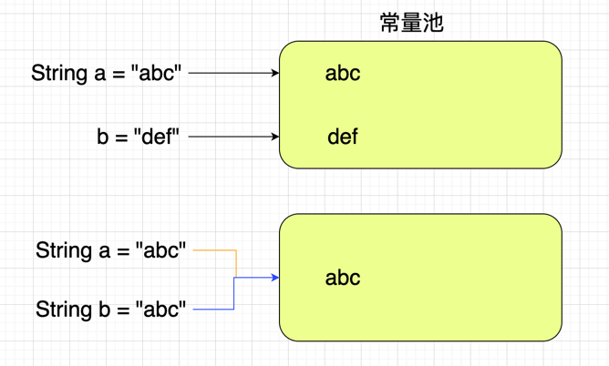

# 为什么不可变

```java
private final char value[];
```

String底层是存储在一个char数组中的，这个数组声明为private表示不可被外部访问，使用
final修饰表示声明后不能被修改。基于此我们可以明确知道String是不可变的。

声明一个String对象，是在常量池中进行创建。当第二次声明同样的String的时候，
并不会再创建，而是将引用直接指向常量池中的对象。如果对String进行修改，也不会在
原来的基础上进行修改，而是在常量池中重新创建一个，把引用地址指到新的地址上。



---
# 为什么要设计为不可变
 
## 效率高

String的一个属性
```java
private int hash;
```

```java
public int hashCode() {
    int h = hash;
    if (h == 0 && value.length > 0) {
        char val[] = value;

        for (int i = 0; i < value.length; i++) {
            h = 31 * h + val[i];
        }
        hash = h;
    }
    return h;
}
```
通过String的hashCode方法可以看出，在计算出hash值后将结果赋值给的String的
hash属性，hash属性默认值为0，每次进来都会进行判断，如果不为0那么就表示该
属性已经计算过hash值，这也说明了String的不可变性。

知道了上面方法的逻辑，我们就可以知道String每次获取hash的时候不需要每次进行
计算，从而提高了效率。

这也是为什么Map大多时候使用String作为key的原因，因为String重写了hashCode，
从而保证了key的唯一性，**通过hash做缓存提高了性能，不需要每次进行运算**。

里

## 安全性
因为String是被final修饰的，所以不存在线程安全问题。